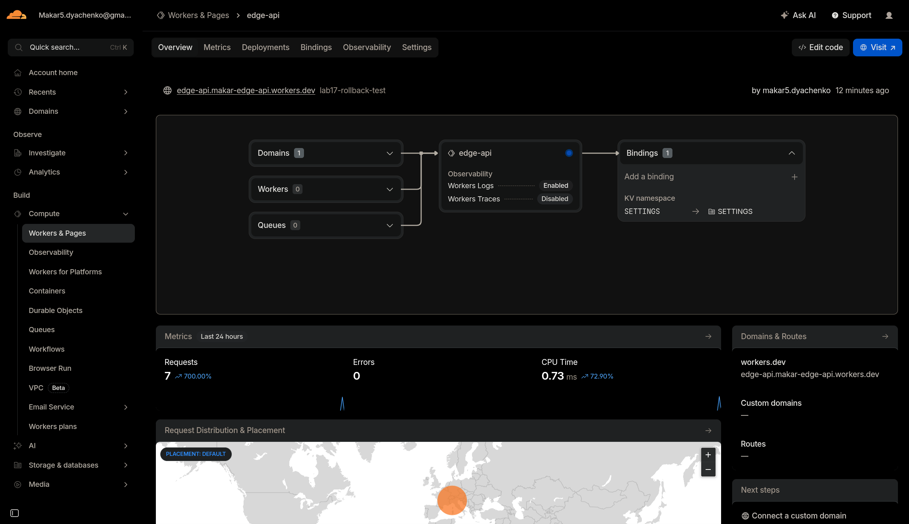
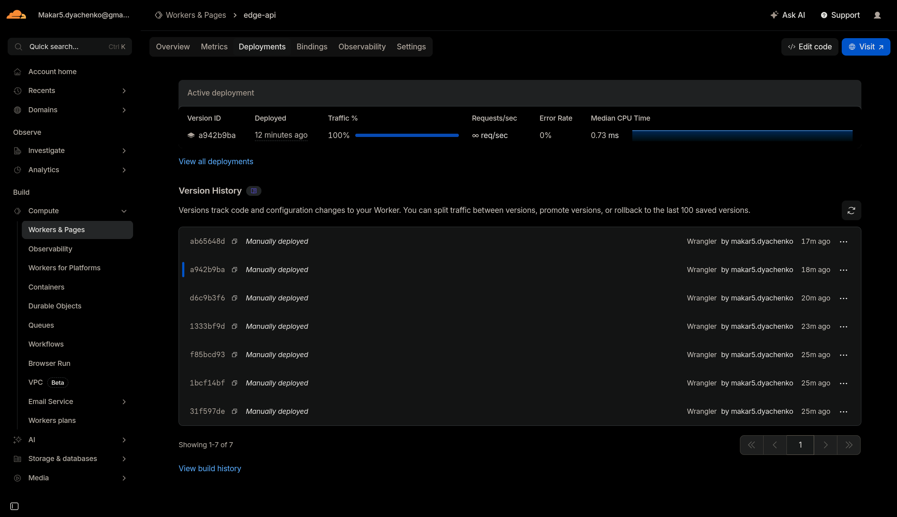
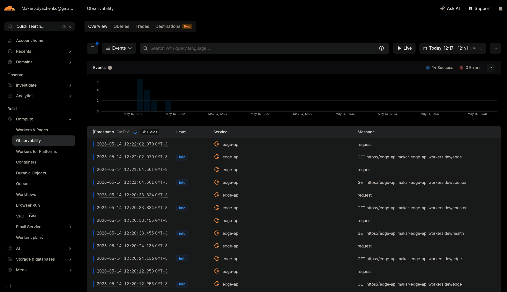

# LAB17 Report - Cloudflare Workers Edge Deployment

Date: 2026-05-14

## Deliverables

- Worker project: [cloudflare/edge-api](cloudflare/edge-api)
- Worker docs/comparison: [cloudflare/WORKERS.md](cloudflare/WORKERS.md)

## Task 1 - Cloudflare Setup

Project created with C3 (Hello World, Worker only, TypeScript). Wrangler auth verified.

Commands and output:

```bash
$ cd /mnt/both/ewewe/Innopolis/DevOps-Core-Course/cloudflare
$ npm create cloudflare@latest -- edge-api
# (interactive) Hello World example, Worker only, TypeScript, no deploy
```

```bash
$ cd /mnt/both/ewewe/Innopolis/DevOps-Core-Course/cloudflare/edge-api
$ npx wrangler whoami

⛅️ wrangler 4.90.1
───────────────────
Getting User settings...
👋 You are logged in with an OAuth Token, associated with the email makar5.dyachenko@gmail.com.
┌──────────────────────────────────────┬──────────────────────────────────┐
│ Account Name                         │ Account ID                       │
├──────────────────────────────────────┼──────────────────────────────────┤
│ Makar5.dyachenko@gmail.com's Account │ c85c22a0ddcc4c986236553ca356e34a │
└──────────────────────────────────────┴──────────────────────────────────┘
```

Notes:
- `workers.dev` subdomain registered: `makar-edge-api`.
- Config and bindings in [cloudflare/edge-api/wrangler.jsonc](cloudflare/edge-api/wrangler.jsonc).

## Task 2 - Build and Deploy a Worker API

Routes implemented in [cloudflare/edge-api/src/index.ts](cloudflare/edge-api/src/index.ts):
- `/` app info
- `/health` health status
- `/edge` edge metadata
- `/counter` KV-backed counter
- `/config` config and secrets presence

Local dev and route tests:

```bash
$ npx wrangler dev --config /mnt/both/ewewe/Innopolis/DevOps-Core-Course/cloudflare/edge-api/wrangler.jsonc --local --port 8787
[wrangler:info] Ready on http://localhost:8787
```

```bash
$ printf "--- /health ---\n" && curl -s http://localhost:8787/health
--- /health ---
{"status":"ok","time":"2026-05-14T09:14:15.464Z"}

$ printf "--- / ---\n" && curl -s http://localhost:8787/
--- / ---
{"app":"edge-api","course":"devops-core","message":"Hello from Cloudflare Workers","timestamp":"2026-05-14T09:14:15.474Z","tokenConfigured":false,"adminConfigured":false}

$ printf "--- /edge ---\n" && curl -s http://localhost:8787/edge
--- /edge ---
{"colo":"MXP","country":"CH","city":"Bellinzona","asn":51852,"httpProtocol":"HTTP/1.1","tlsVersion":"TLSv1.3","time":"2026-05-14T09:14:15.486Z"}

$ printf "--- /counter ---\n" && curl -s http://localhost:8787/counter
--- /counter ---
{"visits":1,"time":"2026-05-14T09:14:15.496Z"}
```

Deployment:

```bash
$ npx wrangler deploy
Uploaded edge-api (11.30 sec)
Deployed edge-api triggers (5.74 sec)
  https://edge-api.makar-edge-api.workers.dev
Current Version ID: d6c9b3f6-6a3f-4c64-b131-31eba6f928bf
```

## Task 3 - Global Edge Behavior

Edge metadata response from public URL:

```bash
$ curl -s https://edge-api.makar-edge-api.workers.dev/edge
{"colo":"MXP","country":"CH","city":"Bellinzona","asn":51852,"httpProtocol":"HTTP/2","tlsVersion":"TLSv1.3","time":"2026-05-14T09:20:24.136Z"}
```

Global distribution explanation:
- Workers runs in Cloudflare data centers globally and executes at the edge closest to the user.
- In VM/PaaS platforms you must choose and manage regions manually; in Workers there is no "deploy to 3 regions" step because Cloudflare handles placement and routing automatically.

Routing concepts:
- `workers.dev` provides a default public URL for Workers.
- Routes attach a Worker to traffic for a Cloudflare-managed zone (domain).
- Custom Domains make the Worker the origin for a domain/subdomain.

## Task 4 - Configuration, Secrets, and Persistence

Plaintext vars configured in [cloudflare/edge-api/wrangler.jsonc](cloudflare/edge-api/wrangler.jsonc). Plaintext vars are not secrets because they are stored in config and can be checked into Git.

Secrets created (values not shown, stored in Cloudflare):

```bash
$ printf "token-$(date +%s)" | npx wrangler secret put API_TOKEN
✨ Success! Uploaded secret API_TOKEN

$ printf "admin-$(date +%s)@example.com" | npx wrangler secret put ADMIN_EMAIL
✨ Success! Uploaded secret ADMIN_EMAIL
```

KV namespace created and bound:

```bash
$ npx wrangler kv namespace create SETTINGS
✨ Success!
To access your new KV Namespace in your Worker, add the following snippet to your configuration file:
{
  "kv_namespaces": [
    {
      "binding": "SETTINGS",
      "id": "0c8b07e1751b46d6a468fe5a8550e799"
    }
  ]
}
```

Persistence verified across redeploy:

```bash
$ curl -s https://edge-api.makar-edge-api.workers.dev/counter
{"visits":1,"time":"2026-05-14T09:20:33.834Z"}

$ npx wrangler deploy
Current Version ID: ab65648d-6e0a-4e47-9417-0513a300b6ab

$ curl -s https://edge-api.makar-edge-api.workers.dev/counter
{"visits":2,"time":"2026-05-14T09:21:04.501Z"}
```

## Task 5 - Observability and Operations

Console logging added in [cloudflare/edge-api/src/index.ts](cloudflare/edge-api/src/index.ts) and verified with `wrangler tail`:

```bash
$ npx wrangler tail edge-api --config /mnt/both/ewewe/Innopolis/DevOps-Core-Course/cloudflare/edge-api/wrangler.jsonc
Successfully created tail, expires at 2026-05-14T15:21:41Z
Connected to edge-api, waiting for logs...
GET https://edge-api.makar-edge-api.workers.dev/edge - Ok @ 5/14/2026, 12:22:02 PM
  (log) request { path: '/edge', colo: 'MXP', country: 'CH' }
```

Deployment history:

```bash
$ npx wrangler deployments list
Created:     2026-05-14T09:19:23.505Z
Author:      makar5.dyachenko@gmail.com
Source:      Unknown (deployment)
Version(s):  (100%) a942b9ba-4f75-44b9-80db-d943ff1e1176

Created:     2026-05-14T09:20:51.380Z
Author:      makar5.dyachenko@gmail.com
Source:      Unknown (deployment)
Version(s):  (100%) ab65648d-6e0a-4e47-9417-0513a300b6ab
```

Rollback:

```bash
$ npx wrangler rollback --message "lab17-rollback-test"
SUCCESS  Worker Version a942b9ba-4f75-44b9-80db-d943ff1e1176 has been deployed to 100% of traffic.
Current Version ID: a942b9ba-4f75-44b9-80db-d943ff1e1176
```

Metrics:
- Open Cloudflare dashboard -> Workers -> edge-api -> Analytics.
- Capture request count/error metric screenshot (see screenshot list below).

## Task 6 - Documentation and Comparison

The required documentation and comparison table are in [cloudflare/WORKERS.md](cloudflare/WORKERS.md).

## Checklist

- [x] Cloudflare account created
- [x] Workers project initialized
- [x] Wrangler authenticated
- [x] Worker deployed to `workers.dev`
- [x] `/health` endpoint working
- [x] Edge metadata endpoint implemented
- [x] At least 1 plaintext variable configured
- [x] At least 2 secrets configured
- [x] KV namespace created and bound
- [x] Persistence verified after redeploy
- [x] Logs or metrics reviewed
- [x] Deployment history viewed
- [x] `WORKERS.md` documentation complete
- [x] Kubernetes comparison documented

## Screenshots



