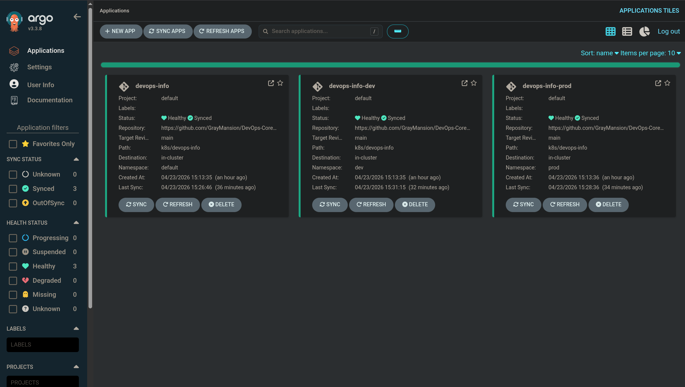
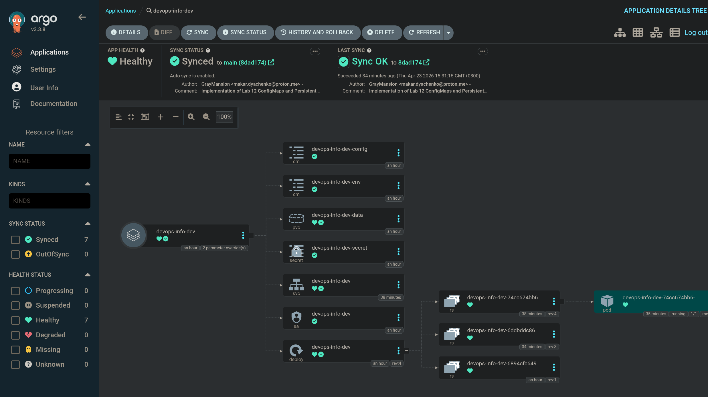
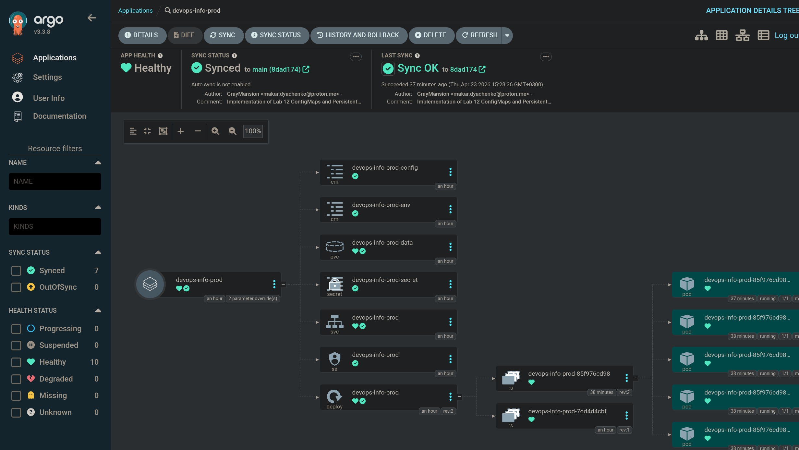
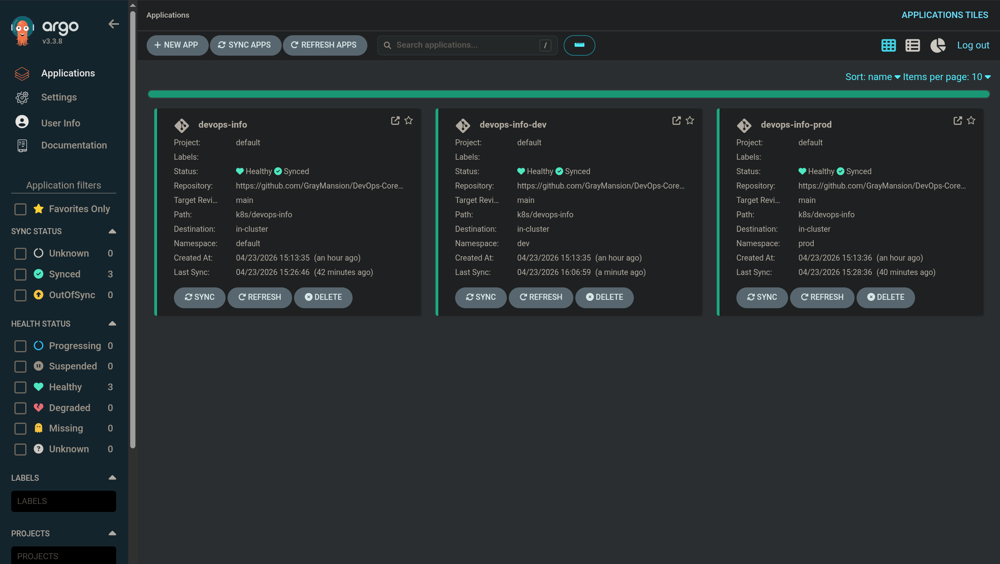

# LAB13 Report - GitOps with ArgoCD

## Summary

Lab 13 was executed live on the local Kubernetes cluster and completed with ArgoCD-managed deployments.

What was done:

- ArgoCD installed via Helm into namespace `argocd`.
- ArgoCD CLI logged in through port-forward.
- Three Application resources deployed:
  - `devops-info` (manual sync)
  - `devops-info-dev` (auto-sync with prune/self-heal)
  - `devops-info-prod` (manual sync)
- Applications were synced and reached healthy state.
- Self-healing behavior was tested (manual scale drift, pod deletion, config drift by image edit).

## Files Used

- `k8s/argocd/application.yaml`
- `k8s/argocd/application-dev.yaml`
- `k8s/argocd/application-prod.yaml`
- `k8s/argocd/applicationset.yaml` (bonus manifest prepared)

## Task 1 - ArgoCD Installation & Setup (2 pts)

Commands executed:

```bash
helm version --short
kubectl version --client
argocd version --client

helm repo add argo https://argoproj.github.io/argo-helm
helm repo update
kubectl create namespace argocd
helm upgrade --install argocd argo/argo-cd --namespace argocd
kubectl get pods -n argocd

kubectl -n argocd get secret argocd-initial-admin-secret -o jsonpath='{.data.password}' | base64 -d
kubectl port-forward svc/argocd-server -n argocd 8080:443
argocd login localhost:8080 --insecure --username admin --password '<retrieved-password>'
```

Evidence excerpts:

```text
helm: v4.1.3+gc94d381
kubectl client: v1.35.3
argocd client: v3.3.3
```

```text
Release "argocd" does not exist. Installing it now.
STATUS: deployed
```

```text
argocd-server-...                      1/1 Running
argocd-repo-server-...                 1/1 Running
argocd-application-controller-0        1/1 Running
```

---

## Task 2 - Application Deployment (3 pts)

Applications applied:

```bash
kubectl apply -f k8s/argocd/application.yaml
kubectl apply -f k8s/argocd/application-dev.yaml
kubectl apply -f k8s/argocd/application-prod.yaml
argocd app list
```

Evidence excerpt:

```text
argocd/devops-info       ... default ... Manual
argocd/devops-info-dev   ... dev     ... Auto-Prune
argocd/devops-info-prod  ... prod    ... Manual
```

Sync commands used:

```bash
argocd app sync devops-info --prune
argocd app sync devops-info-dev --prune
argocd app sync devops-info-prod --prune

argocd app wait devops-info --health --sync
argocd app wait devops-info-dev --health --sync
argocd app wait devops-info-prod --health --sync
```

Final status:

```text
argocd/devops-info       ... Synced  Healthy  Manual
argocd/devops-info-dev   ... Synced  Healthy  Auto-Prune
argocd/devops-info-prod  ... Synced  Healthy  Manual
```

---

## Task 3 - Multi-Environment Deployment (3 pts)

Namespaces:

```bash
kubectl create ns dev
kubectl create ns prod
```

Environment strategy:

- Dev app: `values-dev.yaml`, automated sync (`prune`, `selfHeal` enabled).
- Prod app: `values-prod.yaml`, manual sync.

Runtime evidence:

```text
# default namespace
devops-info-...   1/1 Running (3 pods)

# dev namespace
devops-info-dev-... 1/1 Running (1 pod)

# prod namespace
devops-info-prod-... 1/1 Running (5 pods)
```

---

## Task 4 - Self-Healing & Sync Policies (2 pts)

### 1. Manual scale drift (ArgoCD self-heal)

Executed:

```bash
kubectl scale deployment devops-info-dev -n dev --replicas=5
kubectl get deploy devops-info-dev -n dev -o custom-columns=NAME:.metadata.name,DESIRED:.spec.replicas,READY:.status.readyReplicas
```

Observed:

```text
Before scale: 1
After manual scale: 5
Later state: DESIRED=1 READY=1
```

This confirms ArgoCD auto-sync/self-heal restored desired replicas from Git values.

### 2. Pod deletion test (Kubernetes self-healing)

Executed:

```bash
kubectl get pods -n dev -l app.kubernetes.io/instance=devops-info-dev -o name
kubectl delete pod -n dev <pod-name>
kubectl get pods -n dev -l app.kubernetes.io/instance=devops-info-dev -o wide
```

Observed:

```text
pod "devops-info-dev-..." deleted
new pod "devops-info-dev-..." created immediately
```

This is Kubernetes ReplicaSet behavior (pod-level self-healing), not ArgoCD sync.

### 3. Configuration drift test

Label/annotation drift in this setup was quickly reconciled and did not produce a stable visible diff.
A stronger spec drift was tested by editing the container image directly:

```bash
kubectl get deploy devops-info-dev -n dev -o jsonpath='{.spec.template.spec.containers[0].image}'
kubectl set image deployment/devops-info-dev -n dev devops-info=busybox:1.36
kubectl get deploy devops-info-dev -n dev -o jsonpath='{.spec.template.spec.containers[0].image}'
```

Observed immediate drift:

```text
graymansion/devops-info-service:latest
busybox:1.36
```

Then checked again:

```bash
kubectl get deploy devops-info-dev -n dev -o jsonpath='{.spec.template.spec.containers[0].image}'
```

Recovered value:

```text
graymansion/devops-info-service:latest
```

This demonstrates ArgoCD reconciliation of spec-level drift.

### 4. Sync behavior summary

- Kubernetes self-heals runtime failures (for example deleted pods) to match Deployment state already in cluster.
- ArgoCD self-heals desired configuration drift to match Git-declared state.
- ArgoCD sync can be triggered by:
  - auto-sync policy,
  - drift detection with self-heal,
  - manual sync,
  - periodic refresh/polling.

---

## Screenshot

Stored all images in `docs/screenshots/lab13/`.









---

## Checklist

### Task 1 - ArgoCD Installation & Setup
- [x] ArgoCD installed via Helm
- [x] All pods running in `argocd` namespace
- [x] UI accessible via port-forward
- [x] Admin password retrieved
- [x] CLI installed and logged in

### Task 2 - Application Deployment
- [x] `k8s/argocd/` directory created
- [x] Application manifests created
- [x] Applications visible in ArgoCD
- [x] Initial sync completed
- [x] Apps are deployed and healthy

### Task 3 - Multi-Environment Deployment
- [x] `dev` and `prod` namespaces created
- [x] Dev auto-sync configured
- [x] Prod manual sync configured
- [x] Different environment values used
- [x] Both environments deployed

### Task 4 - Self-Healing & Documentation
- [x] Manual scale drift test performed
- [x] Pod deletion test performed
- [x] Configuration drift tested (image edit)
- [x] Sync behavior documented
- [x] Report completed
