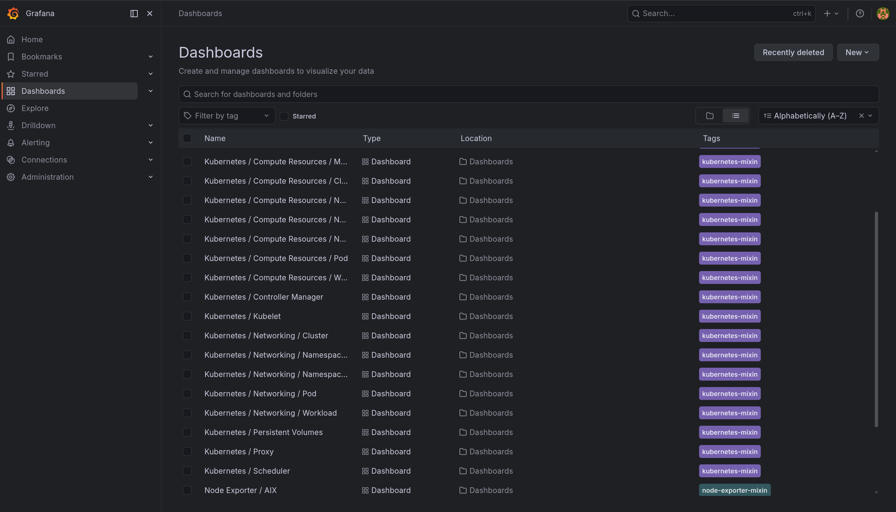
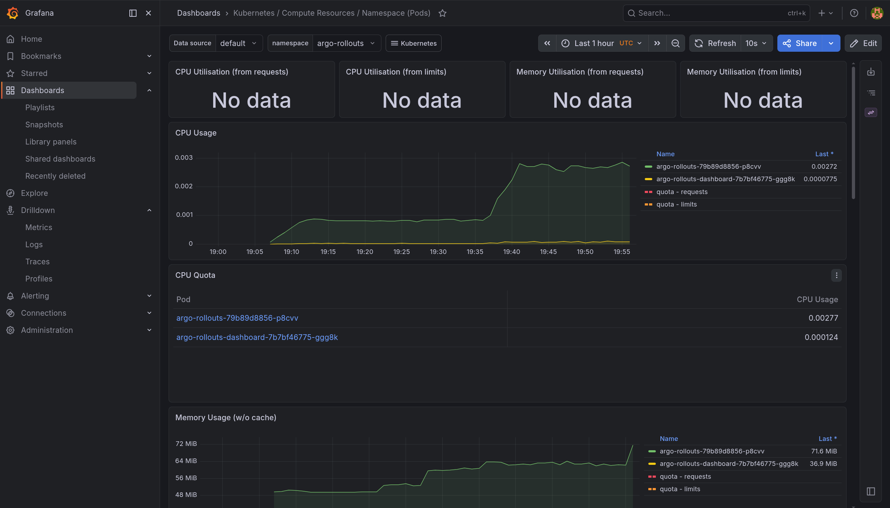
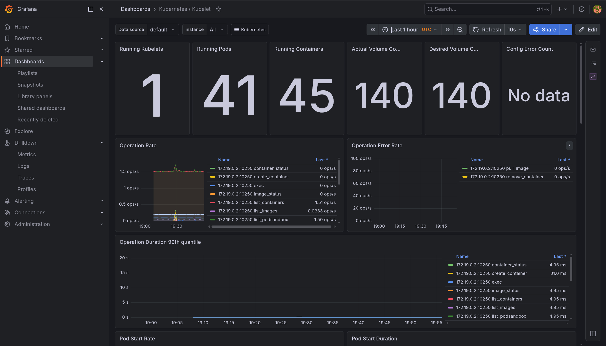
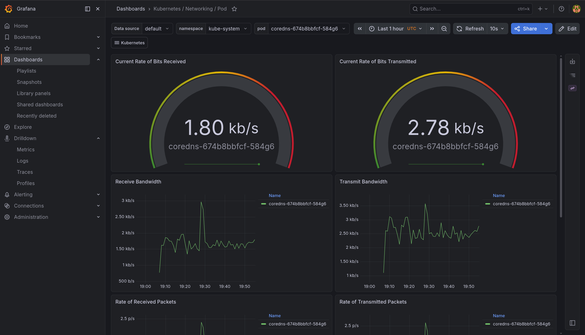

# Lab 16 - Kubernetes Monitoring and Init Containers

This file contains the required evidence and answers for Lab 16.

## Task 1 - Kube-Prometheus Stack

### Components (summary)
- Prometheus Operator: Manages Prometheus, Alertmanager, and related CRDs (ServiceMonitor, PrometheusRule) for declarative monitoring.
- Prometheus: Scrapes and stores metrics in a time-series database; evaluates alerting and recording rules.
- Alertmanager: Deduplicates, groups, and routes alerts to notification channels.
- Grafana: Visualizes metrics with dashboards and ad-hoc queries.
- kube-state-metrics: Exposes Kubernetes object state as metrics (Deployments, Pods, Nodes, etc.).
- node-exporter: Exposes node-level OS and hardware metrics.

### Tooling and cluster context
Commands:
```bash
kubectl version --client
kubectl config current-context
kubectl cluster-info --request-timeout=5s
helm version
```
Output:
```text
Client Version: v1.35.3
Kustomize Version: v5.7.1

kubernetes-admin@lab9

Kubernetes control plane is running at https://127.0.0.1:40751
CoreDNS is running at https://127.0.0.1:40751/api/v1/namespaces/kube-system/services/kube-dns:dns/proxy

To further debug and diagnose cluster problems, use 'kubectl cluster-info dump'.

version.BuildInfo{Version:"v4.1.3", GitCommit:"c94d381b03be117e7e57908edbf642104e00eb8f", GitTreeState:"", GoVersion:"go1.26.1-X:nodwarf5", KubeClientVersion:"v1.35"}
```

### Install and verify
Commands:
```bash
helm repo add prometheus-community https://prometheus-community.github.io/helm-charts
helm repo update
helm upgrade --install monitoring prometheus-community/kube-prometheus-stack \
  --namespace monitoring \
  --create-namespace
helm list -n monitoring
kubectl get po,svc -n monitoring
```
Output:
```text
NAME            NAMESPACE       REVISION        UPDATED                                 STATUS          CHART                           APP VERSION
monitoring      monitoring      2               2026-05-13 22:27:00.31307422 +0300 MSK  deployed        kube-prometheus-stack-85.0.2    v0.90.1

NAME                                                         READY   STATUS    RESTARTS   AGE
pod/alertmanager-monitoring-kube-prometheus-alertmanager-0   2/2     Running   0          5h
pod/monitoring-grafana-764bcdbb95-vpv6t                      3/3     Running   0          13s
pod/monitoring-kube-prometheus-operator-5cdd7dcf48-s4p42     1/1     Running   0          5h
pod/monitoring-kube-state-metrics-5746795bd9-wvjsv           1/1     Running   0          5h
pod/monitoring-prometheus-node-exporter-k7gj6                1/1     Running   0          5h
pod/prometheus-monitoring-kube-prometheus-prometheus-0       2/2     Running   0          5h

NAME                                              TYPE        CLUSTER-IP      EXTERNAL-IP   PORT(S)                      AGE
service/alertmanager-operated                     ClusterIP   None            <none>        9093/TCP,9094/TCP,9094/UDP   5h
service/monitoring-grafana                        ClusterIP   10.96.184.121   <none>        80/TCP                       5h
service/monitoring-kube-prometheus-alertmanager   ClusterIP   10.96.225.211   <none>        9093/TCP,8080/TCP            5h
service/monitoring-kube-prometheus-operator       ClusterIP   10.96.186.52    <none>        443/TCP                      5h
service/monitoring-kube-prometheus-prometheus     ClusterIP   10.96.81.80     <none>        9090/TCP,8080/TCP            5h
service/monitoring-kube-state-metrics             ClusterIP   10.96.128.167   <none>        8080/TCP                     5h
service/monitoring-prometheus-node-exporter       ClusterIP   10.96.123.249   <none>        9100/TCP                     5h
service/prometheus-operated                       ClusterIP   None            <none>        9090/TCP                     5h
```

## Task 2 - Grafana Dashboard Answers

Grafana dashboards are required by the lab; values below are collected via Prometheus API queries (same data source as Grafana).

### Node information used in queries
Command:
```bash
kubectl get nodes -o wide
```
Output:
```text
NAME                 STATUS   ROLES           AGE   VERSION   INTERNAL-IP   EXTERNAL-IP   OS-IMAGE                         KERNEL-VERSION    CONTAINER-RUNTIME
lab9-control-plane   Ready    control-plane   48d   v1.33.1   172.19.0.2    <none>        Debian GNU/Linux 12 (bookworm)   7.0.0-1-cachyos   containerd://2.1.1
```

### 1) Pod resources for StatefulSet (devops-info)
CPU (cores):
```bash
curl -sG http://127.0.0.1:19090/api/v1/query \
  --data-urlencode 'query=sum by (pod) (rate(container_cpu_usage_seconds_total{namespace="default", pod=~"devops-info-[0-9]+", container!="", image!=""}[5m]))' \
  | jq -r '.data.result[] | "\(.metric.pod)\t\(.value[1])"'
```
Output:
```text
devops-info-1   0.0008866605818432672
devops-info-0   0.0009011414096789395
devops-info-2   0.0008719239195450103
```
Memory (bytes):
```bash
curl -sG http://127.0.0.1:19090/api/v1/query \
  --data-urlencode 'query=sum by (pod) (container_memory_working_set_bytes{namespace="default", pod=~"devops-info-[0-9]+", container!="", image!=""})' \
  | jq -r '.data.result[] | "\(.metric.pod)\t\(.value[1])"'
```
Output:
```text
devops-info-1   39534592
devops-info-0   37691392
devops-info-2   37781504
```
Computed summary:
- devops-info-0: ~0.901 mCPU, ~35.96 MiB
- devops-info-1: ~0.887 mCPU, ~37.71 MiB
- devops-info-2: ~0.872 mCPU, ~36.04 MiB

### 2) Most/least CPU pods in default namespace
Command:
```bash
curl -sG http://127.0.0.1:19090/api/v1/query \
  --data-urlencode 'query=sum by (pod) (rate(container_cpu_usage_seconds_total{namespace="default", container!="", image!=""}[5m]))' \
  | jq -r '.data.result[] | "\(.metric.pod)\t\(.value[1])"' \
  | awk 'NR==1{min=$2;max=$2;minpod=$1;maxpod=$1} $2<min{min=$2;minpod=$1} $2>max{max=$2;maxpod=$1} END{print "min\t" minpod "\t" min; print "max\t" maxpod "\t" max}'
```
Output:
```text
min     init-wait-demo  0.000004324412596006146
max     devops-info-service-76df4867ff-fcwfs    0.0009510842317468441
```

### 3) Node metrics (memory usage and CPU cores)
Memory usage (%):
```bash
curl -sG http://127.0.0.1:19090/api/v1/query \
  --data-urlencode 'query=100 * (1 - (node_memory_MemAvailable_bytes{instance="172.19.0.2:9100"} / node_memory_MemTotal_bytes{instance="172.19.0.2:9100"}))' \
  | jq -r '.data.result[] | .value[1]'
```
Output:
```text
57.43409672220826
```
Memory usage (MB):
```bash
curl -sG http://127.0.0.1:19090/api/v1/query \
  --data-urlencode 'query=(node_memory_MemTotal_bytes{instance="172.19.0.2:9100"} - node_memory_MemAvailable_bytes{instance="172.19.0.2:9100"}) / 1024 / 1024' \
  | jq -r '.data.result[] | .value[1]'
```
Output:
```text
18209.390625
```
CPU cores:
```bash
curl -sG http://127.0.0.1:19090/api/v1/query \
  --data-urlencode 'query=count(count by (cpu) (node_cpu_seconds_total{instance="172.19.0.2:9100"}))' \
  | jq -r '.data.result[] | .value[1]'
```
Output:
```text
20
```

### 4) Kubelet (pods and containers managed)
Pods:
```bash
curl -sG http://127.0.0.1:19090/api/v1/query \
  --data-urlencode 'query=kubelet_running_pods' \
  | jq -r '.data.result[] | "\(.metric.instance)\t\(.value[1])"'
```
Output:
```text
172.19.0.2:10250        41
```
Containers (running state):
```bash
curl -sG http://127.0.0.1:19090/api/v1/query \
  --data-urlencode 'query=kubelet_running_containers{container_state="running"}' \
  | jq -r '.data.result[] | "\(.metric.instance)\t\(.value[1])"'
```
Output:
```text
172.19.0.2:10250        45
```

### 5) Network traffic for default namespace
Receive rate (bytes/s):
```bash
curl -sG http://127.0.0.1:19090/api/v1/query \
  --data-urlencode 'query=sum(rate(container_network_receive_bytes_total{namespace="default"}[5m]))' \
  | jq -r '.data.result[] | .value[1]'
```
Output:
```text
1381.0392873838382
```
Transmit rate (bytes/s):
```bash
curl -sG http://127.0.0.1:19090/api/v1/query \
  --data-urlencode 'query=sum(rate(container_network_transmit_bytes_total{namespace="default"}[5m]))' \
  | jq -r '.data.result[] | .value[1]'
```
Output:
```text
1415.5208848296004
```
Summary: RX ~1.35 KB/s, TX ~1.38 KB/s.

### 6) Alerts (active)
Command:
```bash
curl -sG http://127.0.0.1:19090/api/v1/query \
  --data-urlencode 'query=count(ALERTS{alertstate="firing"})' \
  | jq -r '.data.result[] | .value[1]'
```
Output:
```text
10
```

## Task 3 - Init Containers

### Init download (file fetched by init container)
Manifest: k8s/init-container-download.yaml

Commands:
```bash
kubectl apply -f k8s/init-container-download.yaml
kubectl get pods -l app=init-download-demo
kubectl logs init-download-demo -c init-download
kubectl exec init-download-demo -- cat /data/index.html | head -n 5
```
Output:
```text
pod/init-download-demo created

NAME                 READY   STATUS    RESTARTS   AGE
init-download-demo   1/1     Running   0          4s

wget: note: TLS certificate validation not implemented

Defaulted container "main-app" out of: main-app, init-download (init)
<!doctype html><html lang="en"><head><title>Example Domain</title><meta name="viewport" content="width=device-width, initial-scale=1"><style>body{background:#eee;width:60vw;margin:15vh auto;font-family:system-ui,sans-serif}h1{font-size:1.5em}div{opacity:0.8}a:link,a:visited{color:#348}</style></head><body><div><h1>Example Domain</h1><p>This domain is for use in documentation examples without needing permission. Avoid use in operations.</p><p><a href="https://iana.org/domains/example">Learn more</a></p></div></body></html>
```

### Wait-for-service pattern
Manifest: k8s/init-container-wait.yaml

Commands:
```bash
kubectl apply -f k8s/init-container-wait.yaml
kubectl get deploy wait-service
kubectl get pods -l app=init-wait-demo
kubectl logs init-wait-demo -c wait-for-service
```
Output:
```text
service/wait-service unchanged
deployment.apps/wait-service unchanged
pod/init-wait-demo unchanged

NAME           READY   UP-TO-DATE   AVAILABLE   AGE
wait-service   0/1     1            0           15s

NAME             READY   STATUS    RESTARTS   AGE
init-wait-demo   1/1     Running   0          9s

Server:         10.96.0.10
Address:        10.96.0.10:53

Name:   wait-service.default.svc.cluster.local
Address: 10.96.73.63
```

## Task 4 - Documentation

This file (k8s/MONITORING.md) contains the required documentation.

## Screenshots







## Checklist

- [x] Prometheus stack installed
- [x] All 6 dashboard questions answered
- [x] Screenshots included
- [x] Init container downloading file
- [x] Wait-for-service pattern implemented
- [x] `k8s/MONITORING.md` complete